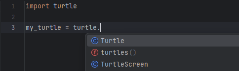
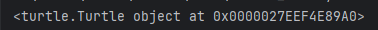

# Object oriented programming

In procedural programming, the computer is mostly working from top to bottom and then jumping out into a function as needed. For more complex programs, this way of programming quickly makes the code very complicated. Procedural programming is one of the earliest paradigms of programming. Early languages rely almost only on that principle.

With object oriented programming we can write complex code in a simple way. With object oriented programming, the program is broken down into smaller modules. We basically split the tasks into smaller pieces that become reusable in the future. Object oriented programming is called that way because it is modeling objects. An object can have attributes and methods. Attributes are variables that are associated with the object. Methods are functions that a particular object can do. We can have multiple objects with the same type. So once we have setup an object, we can have multiple versions of that object. We use it like a blueprint. In OOP, we call this blueprint a class and the things generated from that blueprint we call objects.

Example: Car

You create an object from a class like this: `car = CarBlueprint()` With car being the variable that holds the object and `CarBlueprint()` being the class that is defined somewhere. We can import modules that contain classes that other people wrote. An example would be the turtle module. PyCharm let's us know Turtle is a class by the blue C in front of it.

We have now constructed the new object. When we print an object, we see that it is an object and at which location in the computers memory it gets saved.

We access attributes and methods of an object with a dot like `car.color` or `car.drive()`. The code identifies the object and says get the color or do the method.